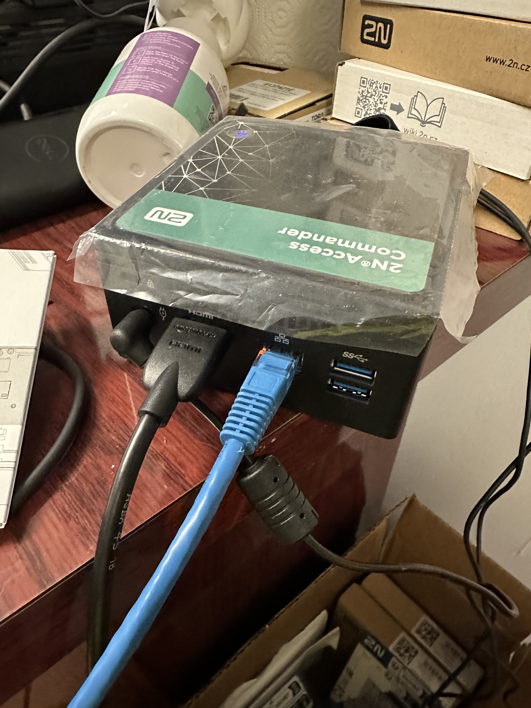
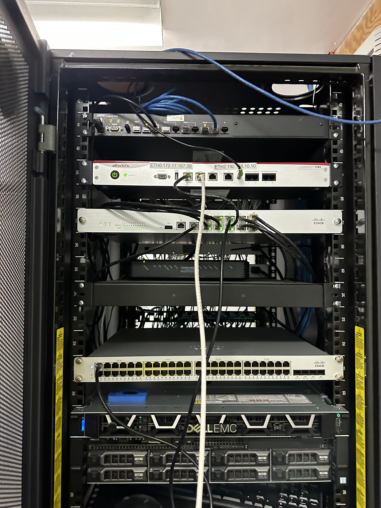
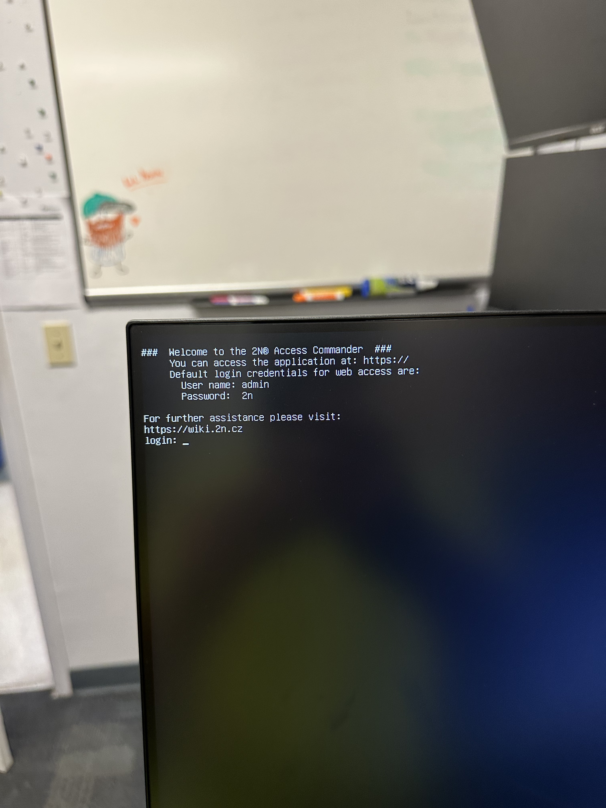
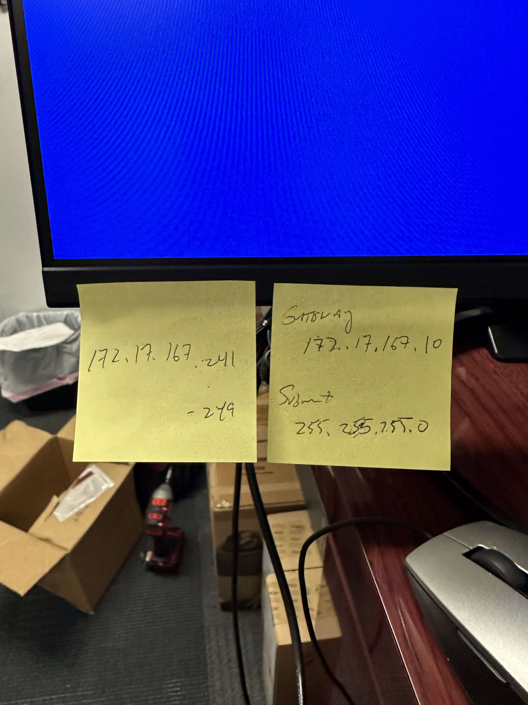
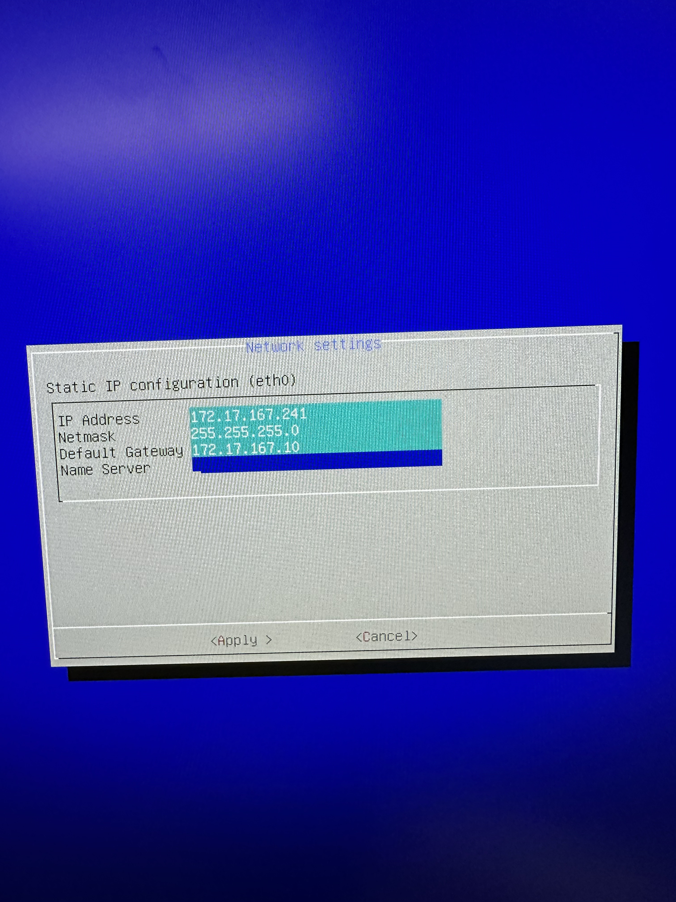
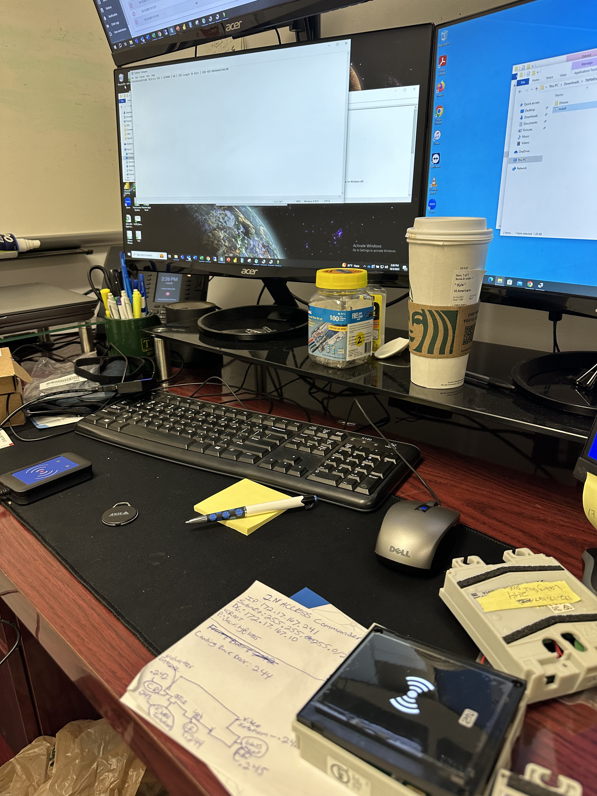
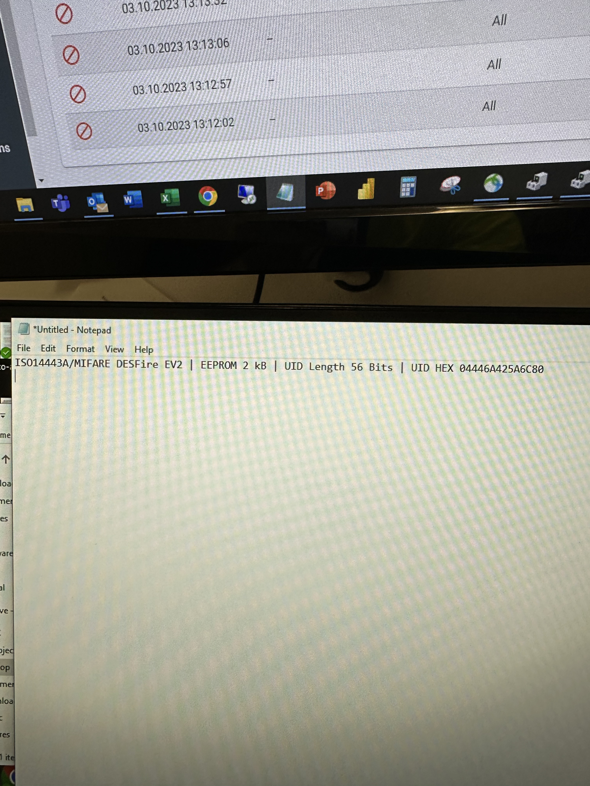
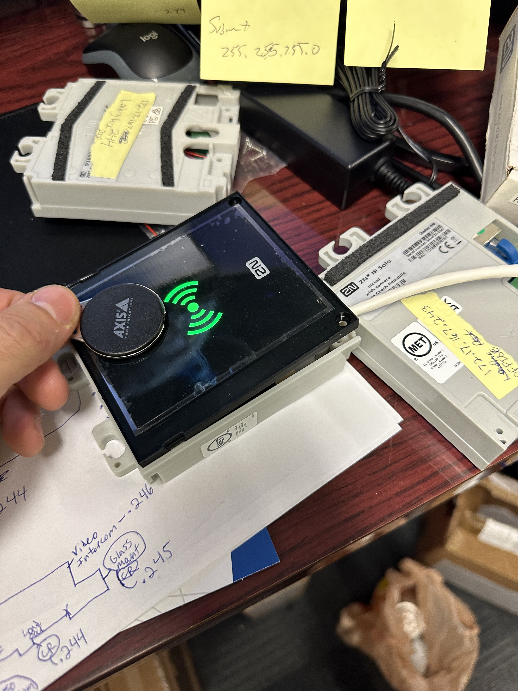

# 2N Access Commander Install/Configuration on the Field
## Table of Contents
1. Assignment and Research
2. Install
3. Configure

# Assignment and Research
- My employer assigned me to install and configure a 2N Access Commander, my project manager that assigned this to me said this is a new unit that the company hasn't used before and asked me to figure it out, as a newly hire i was more than excited to accept the challenge!

- First and foremost, I looked up what a 2N Access Commander can do, which is, an access control software that is highly scable to manage and monitor access status within office intercom systems, tracking attendance, access rules and much more. 

- Here is the unit given to me, that now has our display hooked up and temporarily connected to the network router

# Install
  
- The unit is with a linux operating system, with the default login displayed there ( Always change default credentials, lets protect our envirnoments with a very simple process.)
- As install was talking place, the system administrator walked in to hand me their designated subnet masks set aside for all the access control card readers and keyfobs.

- We weren't assigned with programming each keyfob/card but were instructed to show their in-house I.T technician how to do it.

- Heading back into the 2N Access Commander, i head over to the network settings to configure the devices IP address along with the default gateway that is all corresponding with the subnet given for us.
# Configure

- Now its time to get cranking on each card reader so that the team and i can finish our install, with the subnet given, we start from 172.17.167.242 to 172.17.167.249, each card reader getting their assigned IP w/ their corresponding tag on the underside. 
- After assigning, its time to move unto the keyfobs to ensure everything is properly working and is giving us access.

- Scanning the keyfob on the fob reader, our MIFARE DESFire EV2 keyfob properly gets identified

- And then using our same keyfob, we one more time within our 2N Access Commander webpage, create a profile and scan the fob within the devices access tab and get authorized.
